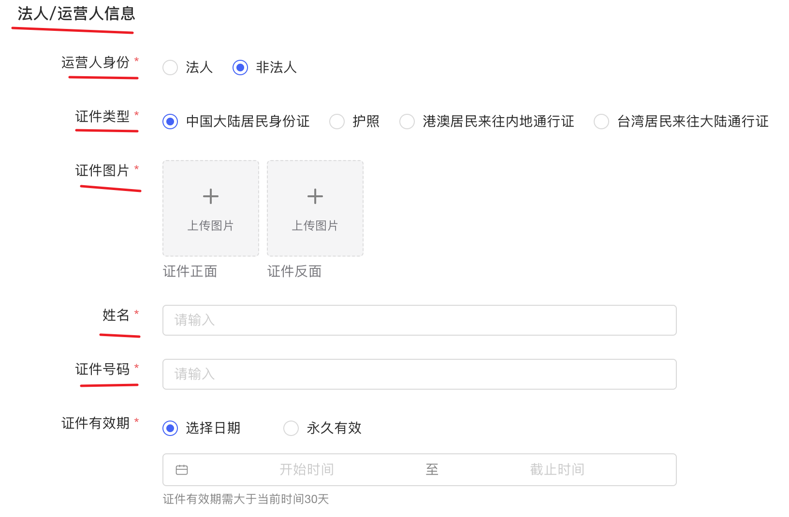

小红书开发者平台不像其他第三方平台的开发者平台统一，它分为电商平台、小程序平台、分享平台等等，我们目前需要的只是分享平台

在我完成申请之后（目前申请结果还没反馈）会获得 appKey 和 appSecret
接着引入JS API
> <script src="https://fe-static.xhscdn.com/biz-static/goten/xhs-1.0.1.js"></script>

然后传入参数
```
xhs.share({
  shareInfo: {
    type: ' ', // 必填，笔记类型 'video' | 'normal'
    title: ' ', // 笔记标题
    content: ' ', // 笔记正文
    images:  [] //图文类型必填，笔记图片，必须是服务器地址，暂时不支持本地文件
    video: ' ', // 视频类型必填，必须是服务器地址
    cover: ' ' // 视频封面图，必须是服务器地址，暂时不支持本地文件
  },
  verifyConfig: {
    appKey: ' ' //必填，应用的唯一标识,
    nonce: ' ', // 必填，服务端生成签名的随机字符串
    timestamp: ' ', // 必填，服务端生成签名的时间戳
    signature: ' ', // 必填，服务端生成的签名
  },
  fail: (e) => {
   // 调用失败时执行的回调函数
  },
})
```

```
>无论是公开的API文档还是冯老师发的内测文档，小红书主要API主要面向对象都是商家

# 目前进展
能实现通信和跳转，但是 1.没有appid等参数无法测试能否传输数据；2.还没实现跳转到发布页面，其中官方客服是这么说的：

根据小红书小程序开放平台的相关文档，对于您提出的“第三方平台呈现一个二维码，用户在用手机上小红书APP扫描二维码后跳转到素材发布页面，其中素材由第三方平台上传，用户可以配置后一键发布”的需求，平台确实提供了一定的支持，但需要注意的是：

1. **二维码生成与扫描**：小红书小程序支持生成二维码，用户可以通过小红书APP扫描该二维码跳转到指定页面。这个功能可以通过调用小红书的API来实现。
2. **素材上传与配置**：用户可以通过API上传素材，并在跳转的页面中配置这些素材。但是，根据《小红书小程序管理规范》第5.1.1.10条的规定，未经小红书授权的情况下，小程序不能提供与小红书客户端功能相同或类似的功能，这意味着小程序不能完全复制小红书客户端的笔记发布功能。因此，尽管可以上传和配置素材，但具体的“一键发布”功能需要谨慎设计，以免违反平台规则。
3. **用户体验与合规性**：根据《小红书小程序管理规范》第5.1.2.1条和第5.1.2.2条的规定，提交的小程序需要是一个完成品，能够正常运行且具有使用价值。因此，您的功能设计需要确保用户体验良好，避免出现不可运行、闪退、按钮无响应等问题。
4. **授权与隐私**：根据《小红书小程序开放平台第三方平台开发者服务协议》第10.6条的规定，如果您的小程序内存在账户体系，必须提供小红书授权登录，并且在用户拒绝授权的情况下，您需要清除并停止使用用户的个人信息。

综上所述，小红书API支持生成二维码和跳转页面的功能，也支持素材上传与配置。但在实现“一键发布”功能时，需要确保符合平台的运营规范，避免提供与小红书客户端功能相同或类似的发布功能。建议您详细阅读相关文档，并在开发过程中密切关注平台的审核标准和合规要求。如有疑问，可以联系小红书官方支持团队进行确认。


# 公开API文档（申请需要的材料）

我早上成功实现和小红书服务端通信的是图1中的素材中心API

但是 **数据传输是false** ，是因为需要配置 appid 等等参数，于是我想要去“小红书开发平台”控制台创建应用，但是需要 **认证信息** ，需要信息如下：
   - 企业：
      - 企业营业执照
      - 社会信用代码
      - 营业执照注册地址
      - 数据信息表
   - 法人：
      - 法人的姓名和证件号



>注：我申请了个人开发者身份，但是报错资质不够

# 内测文档（未来顾虑和设想）

可以看到主要是面向商家的服务，其中小程序和小组件都是在小红书APP内部的应用，不符合我们要从外转到小红书的目标，我害怕后面也无法实现跳转功能
>注：小红书的小组件目前是内测，只有被邀请开发者能开发


>后面可能可以通过外部掉入小红书我们平台写的小程序或小组件，再从小程序或小组件跳转到发布页面，这点我还在进一步调研中

# 参考文档

- https://segmentfault.com/a/1190000045518431?sort=votes
只说明了流程，并没有演示

- https://github.com/zsmhub/xhs-sdk
从后端角度用go实现的sdk，但是是电商相关的
```
